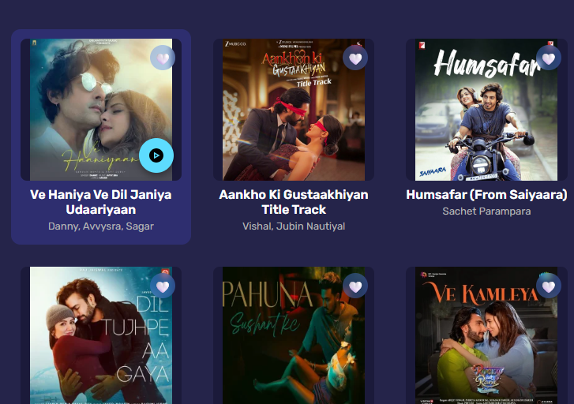
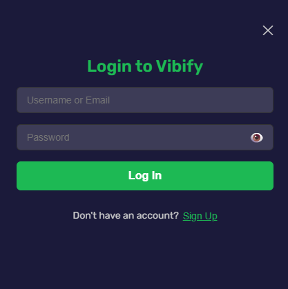
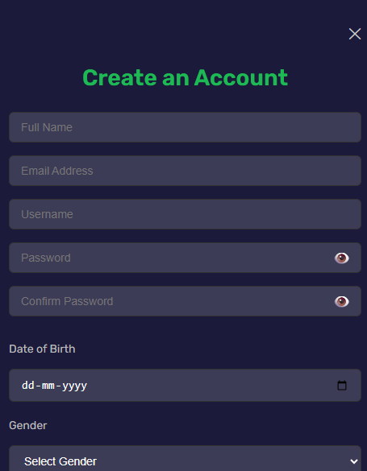
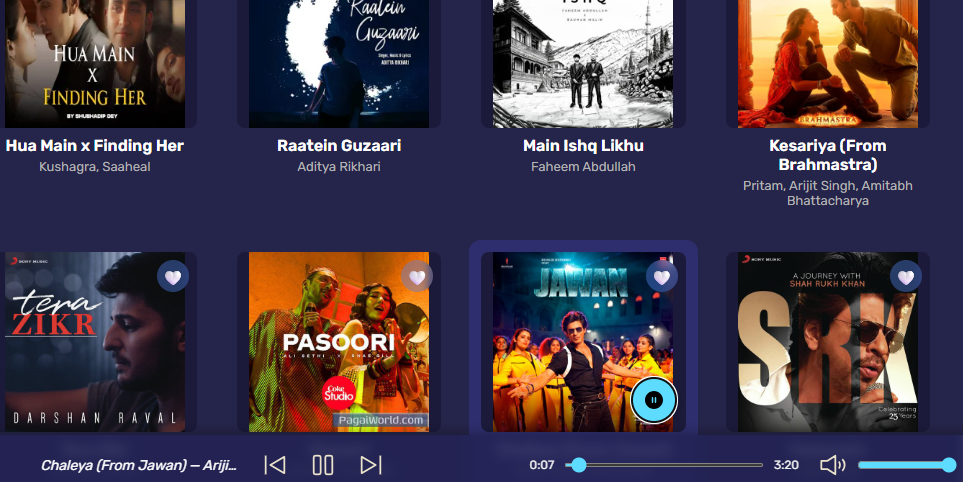
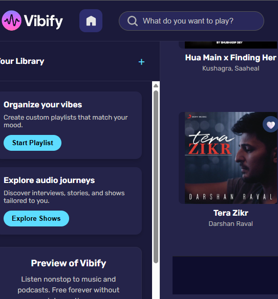

# 🎶 Vibify – A Modern Music Streaming Web App

**Vibify** is a sleek, responsive, and fully interactive music streaming website inspired by Spotify. Users can explore albums, play songs, and enjoy a smooth listening experience—all wrapped in a beautiful dark-themed UI.

---

## ✨ Features

- 🎵 **Stylish Album Cards** – Hover to reveal play button
- ▶️ **Music Controls** – Play, pause, next, previous
- ⏱️ **Seek Bar** – Shows current time & total duration
- 🔉 **Volume Control** – With mute toggle & live icon feedback
- 🔐 **Login / Signup Forms** – Smooth slide-in panels
- 📱 **Responsive Design** – Looks great on desktop & mobile
- 🎨 **Dark Themed UI** – Polished with modern components
- ❤️ **Favorites** – Save your liked tracks locally

---

## 📁 Folder Structure

vibify/ <br>
├── index.html # Entry HTML page <br>
├── style.css # Styles (minimal, JavaScript-dominant) <br>
├── script.js # Core logic and DOM rendering <br>
├── Poster/ # Album artwork images <br>
├── music/ # MP3 audio files <br>
├── icons/ # Play, pause, volume icons (SVG/PNG) <br>
├── vibify-Preview/ # Screenshots for README <br>
└── README.md # This file <br>
---

## 🚀 Getting Started

1. **Clone the repository**

   ```bash
   git clone https://github.com/adilimran21/vibify.git
   cd vibify

2. Open index.html in your browser

No build tools or server setup required.

Works out of the box!

## 📸 UI Preview







## 🛠 Built With

HTML5

CSS3 (Minimal styling – JavaScript-dominant UI)

JavaScript (ES6+) – Full DOM manipulation

Google Fonts – Rubik

SVG Icons – Custom controls for audio player

## 📌 Notes
All components (album cards, forms, player controls) are dynamically rendered using JavaScript.

LocalStorage is used to persist favorite songs.

Designed with mobile-first responsiveness.

## 👨‍💻 Author

[MD ADILIMRAN](https://github.com/adilimran21)  
Frontend Developer | MERN Stack Enthusiast

Feel free to ⭐ star this repo and share feedback or improvements!